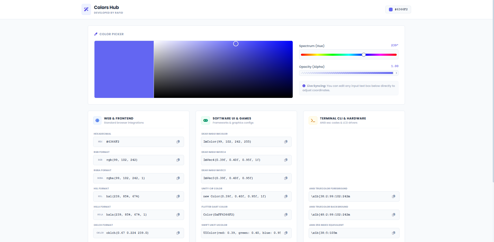

# 🎨 Colors Hub

<p align="center">
  
</p>

**Colors Hub** — A live color picker with instant conversion to 20+ developer-friendly color formats.

---

## ✨ Features

- **Live Color Picker** — Click or drag on the canvas, adjust hue and alpha sliders.
- **20+ Color Formats** — HEX, RGB, HSL, OKLCH, CMYK, Unity, Flutter, Swift, ImGui, ANSI, RGB565, and more.
- **Bidirectional Editing** — Edit any input field and all other formats update instantly.
- **One-Click Copy** — Copy any format to your clipboard with a single click.

---

## 🚀 Quick Start

Clone the repository and open `index.html` in any modern browser.

```bash
git clone https://github.com/rafidahmed870/colors-hub.git
cd colors-hub
# Open index.html in your browser
```

---

## 👤 Author

**Rafid Ahmed**  
GitHub: https://github.com/rafidahmed870